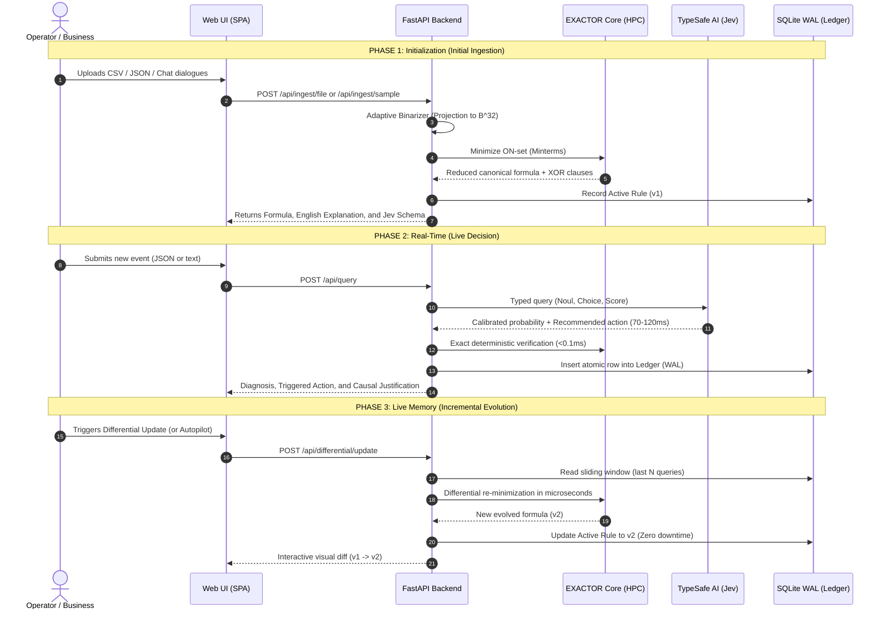

# Architectural and Design Specification: Exactor Accelerator
## Neuro-Symbolic Hybrid System with Live Memory and Real-Time Typed Decisions

> **Technical Audience:** This document is formally structured for AI agents, software architects, and systems engineers to understand the ontology, mathematical foundation, dataflow, API contracts, and user interface design of the **Exactor Accelerator** platform.

---

## 1. Executive Summary & Architectural Paradigm

The **Exactor Accelerator** platform bridges the fundamental gap in modern Artificial Intelligence between two paradigms that have traditionally remained disconnected:

```
┌────────────────────────────────────────────────────────────────────────┐
│                              AI PARADIGMS                              │
├──────────────────────────────────┬─────────────────────────────────────┤
│    GENERATIVE MODELS (LLMs)      │     HYBRID: EXACTOR ACCELERATOR     │
├──────────────────────────────────┼─────────────────────────────────────┤
│ • Token-by-token decoding        │ • Direct typed inference (Jev)      │
│ • High latency: 1,500–4,000 ms   │ • Ultra-low latency: 0.05–120 ms    │
│ • Critical risk of hallucination │ • Zero hallucinations (RLCD types)  │
│ • Unauditable black boxes        │ • 100% boolean causality (Rust HPC) │
│ • Heavy offline batch training   │ • Hot Live Memory (SQLite WAL)      │
└──────────────────────────────────┴─────────────────────────────────────┘
```

The system integrates three complementary engines:
1. **EXACTOR Core HPC (Rust)**: Deterministic boolean minimization engine over hypercubes $\mathbb{B}^k$ ($k \le 32$) distilling irreducible canonical formulas with `AND`, `OR`, `NOT` operators and non-linear `XOR` parities.
2. **Jev System One (TypeSafe AI)**: Calibrated probabilistic model evaluating production events in parallel in microseconds, returning strict data types (`Noul`, `Choice`, `Score`).
3. **Incremental Live Memory (SQLite WAL)**: Concurrent persistence and differential update mechanism eliminating classical MLOps offline retraining cycles.

---

## 2. Mathematical Foundations & Projection onto Hypercube $\mathbb{B}^k$

### 2.1 Boolean State Space
The universe of discourse is modeled as a boolean hypercube of dimension $k$:
$$\mathbb{B}^k = \{0, 1\}^k, \quad k \in [4, 32]$$

For $k = 32$, the state space contains $2^{32} \approx 4,294,967,296$ possible vertices. Each real-world event $e$ is projected via an adaptive binarization function $\phi$:
$$\phi: \mathcal{X} \longrightarrow \mathbb{B}^k, \quad \mathbf{x} \mapsto \mathbf{b} = (p_0, p_1, \dots, p_{k-1})$$

Where each $p_i \in \{0, 1\}$ represents an atomic proposition derived from numerical variables discretized by entropy or semantic tokens extracted from raw text.

### 2.2 Boolean Minimization in EXACTOR (Rust HPC)
Given historical observations with binary labels $y \in \{0, 1\}$, the activation set (*ON-set*) is defined as:
$$S_{ON} = \{ \mathbf{b} \in \mathbb{B}^k \mid y = 1 \}$$

The **EXACTOR Core** engine executes a linear-time reduction $O(n)$ over the binary tree of minterms:
$$f(\mathbf{b}) = \bigvee_{i=1}^m \left( \bigwedge_{j \in C_i} l_j \right) \oplus \bigoplus_{r \in X} l_r$$

Where $l_j \in \{p_j, \neg p_j\}$ are boolean literals and $\oplus$ represents `XOR` parity clauses indispensable for detecting non-linear anomalies (such as banking fraud or microservice cascading failures).

---

## 3. Integration Schema with TypeSafe AI (Jev)

Jev does not generate free-form text. Instead, the system translates EXACTOR's boolean formula into a **typed question contract**:

```json
{
  "model": "jev-latest",
  "state": {
    "event": { "amount": 2450, "failed_attempts": 2, "country_risk": "HIGH" }
  },
  "questions": {
    "criterio_logico": {
      "type": "noul",
      "instructions": "Is the boolean condition derived from historical analysis satisfied? Formula: (~p0 & p1 | p2)..."
    },
    "accion_recomendada": {
      "type": "choice",
      "instructions": "What business action should be executed?",
      "criteria": {
        "BLOCK_TRANSACTION": "Confidence exceeds risk threshold",
        "MANUAL_REVIEW": "Uncertainty in boundary parameters",
        "APPROVE": "No critical conditions triggered"
      }
    },
    "calibracion_criticidad": {
      "type": "score",
      "instructions": "Evaluate ordinal severity from 0 to 1.",
      "criteria": { "low": "0.0 - 0.3", "medium": "0.3 - 0.7", "critical": "0.7 - 1.0" }
    }
  }
}
```

### 3.1 Typed Primitives
* **`Noul` (Bernoulli Distribution)**: Returns a continuous calibrated probability $P(\text{True}) \in [0.0, 1.0]$ via *RLCD* (Reinforcement Learning with Calibrated Decisions).
* **`Choice` (Categorical Distribution)**: Returns a strict probability vector across the finite set of possible business actions.
* **`Score` (Continuous/Ordinal Distribution)**: Quantifies the magnitude of impact or criticality of the event.

---

## 4. Operational Lifecycle (End-to-End Dataflow)



---

## 5. User Interface & Experience Design (UI/UX)

The interface follows a **Cyber-Logic Glassmorphic** aesthetic, prioritizing **business self-service** without sacrificing technical depth required by auditors and regulators.

### 5.1 Dual-View Architecture (`view-mode-toggle`)
* **💼 Business View (Default)**:
  * Prioritizes **Human Language Interpretation** of the rule.
  * Hides dense boolean algebra and raw JSON structures.
  * Displays **3 Executive Decision Cards**:
    1. 🚦 **Case Diagnosis**: Severity and certainty percentage.
    2. ⚡ **Autonomous Action Triggered**: Business action executed in production.
    3. 🔎 **Causal Justification**: Plain-language explanation of factors triggering the rule.
* **🔬 Technical / Audit View**:
  * Displays interactive 32-bit hypercube chip matrix (`bit-chip`).
  * Shows EXACTOR canonical formula with XOR parities.
  * Enables JSON payload inspector and compression telemetry.

### 5.2 Step-by-Step Workflow Guide (`workflow-stepper`)
Unifies navigation into 4 sequential interactive steps:
1. **`1. Ingestion & Logic`**: Historical data upload and rule extraction.
2. **`2. Typed Contract`**: Calibration of Jev question schema.
3. **`3. Live Decision`**: Real-time evaluation of new incoming events.
4. **`4. Live Memory`**: Immutable audit log and hot re-minimization.

### 5.3 Collapsible Content Containers (`collapsible-content`)
To avoid cognitive overload when inspecting 32-variable formulas or long chat transcripts:
* Contained initial height: `max-height: 135px` with smooth bottom gradient (`linear-gradient`).
* Interactive toggle button: `[ ↕ Expand ]` $\leftrightarrow$ `[ ⬆ Collapse ]`.
* Smooth CSS cubic transitions (`cubic-bezier(0.2, 0.8, 0.2, 1)`).

### 5.4 Design System & CSS Tokens
* **Base Background**: `#07090e` with subtle radial gradients.
* **Glass Surfaces**: `rgba(16, 22, 35, 0.78)` with `backdrop-filter: blur(14px)`.
* **Semantic Accents**:
  * Cyan (`#00f2fe`): Telemetry, inputs, and active propositions.
  * Emerald (`#03aa5c`): Certainty, safe cases, and determinism.
  * Magenta (`#d45bb6`): Jev schema and categorical types.
  * Violet (`#8a2be2`): Live memory and differential update.
  * Amber (`#ffb703`): Uncertainty alerts and manual review.
  * Rose (`#ff477e`): Critical cases, fraud, and previous formulas.

---

## 6. REST API Endpoints Specification

| Method | Endpoint | Key Parameters | Functional Description |
| :--- | :--- | :--- | :--- |
| `POST` | `/api/ingest/sample` | `sample_type`, `max_variables` | Loads 500-record synthetic datasets across 6 domains (Fintech, SRE, Churn, SOC, Triage, Support). |
| `POST` | `/api/ingest/file` | `file` (Multipart), `target_col`, `max_vars` | Processes CSV/JSON tabular files or unstructured text uploaded by user. |
| `GET` | `/api/exactor/rules` | None | Returns EXACTOR canonical formula, English explanation, and hypercube metrics. |
| `GET` | `/api/jev/schema` | None | Returns official JSON schema for typed questions (`noul`, `choice`, `score`). |
| `POST` | `/api/query` | `event_state` (JSON/Text), `threshold` | Evaluates event with Jev (<100ms), verifies with EXACTOR (<0.1ms), and triggers action. |
| `POST` | `/api/differential/update` | `window_size` (e.g. 30) | Executes hot boolean re-minimization on recent SQLite WAL queries. |
| `GET` | `/api/ledger` | `limit` (e.g. 35) | Returns immutable audit feed of all live queries and executed actions. |
| `GET` | `/api/system/status` | None | Returns live engine status, token savings, active rule version (`v1`, `v2`, etc.). |

---

## 7. Guidelines for AI Agents in Derivative Work

1. **Mathematical Immutability**: Never attempt to overwrite or replace the EXACTOR formula via natural language prompts. Any rule adjustment must be generated through the boolean engine (`reduction.rs` or the binarization pipeline).
2. **Separation of Concerns**:
   - `state.event`: The only section that end consumers should edit to evaluate live cases.
   - `questions.instructions`: Algorithmically generated and must not be manually modified to avoid loss of causality or stochastic drift.
3. **Persistence and Concurrency**: All audit transactions must keep SQLite in WAL mode (`PRAGMA journal_mode=WAL;`) to guarantee non-blocking reads and writes in high-throughput production environments.
